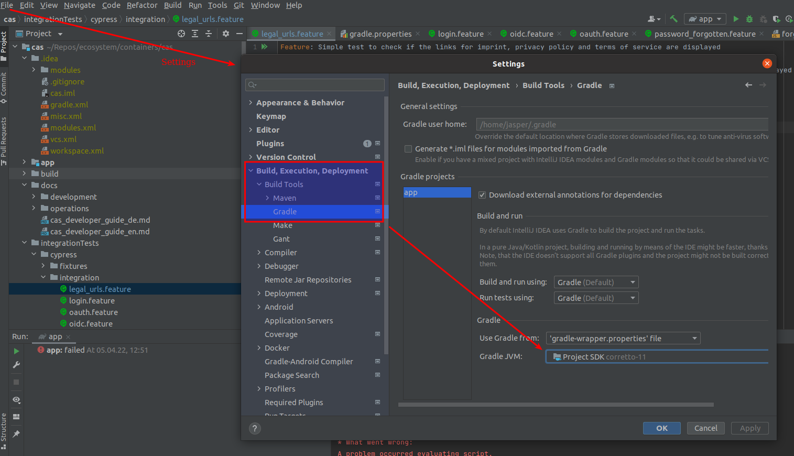

# Verwendung von Werten aus dem etcd in Standalone-App

Die rechtlichen URLs für das Impressum, die Nutzungsbedingungen und die Datenschutzrichtlinie sowie der Text, der
bei einem Klick auf den Passwort-Vergessen-Button angezeigt wird, werden im `etcd` des CES definiert. Beim Start des
Dogus werden die Werte aus dem etcd ausgelesen und entsprechend gesetzt.

Wenn das CAS als Standalone-App außerhalb des CES gebaut und gestartet wird, können die URLs und der Hinweistext für ein
vergessenes Passwort in einer Property-Datei angegeben werden. Hierzu muss im Verzeichnis 
app/src/main/resources eine Properties-Datei mit dem Namen `custom_messages.properties` angelegt werden. In dieser
Datei können dann folgende Werte definiert werden:

- `legal.url.terms.of.service` - Definiert die URL für die Nutzungsbedingungen 
- `legal.url.imprint` - Definiert die URL für das Impressum
- `legal.url.privacy.policy` - Definiert die URL für die Datenschutzrichtlinie 
- `forgot.password.text` - Definiert den Text, der bei einem Klick auf den Passwort-Vergessen-Button angezeigt wird

Eine Beispiel-`custom_messages.properties` sieht folgendermaßen aus:
```
legal.url.terms.of.service=https://www.itzbund.de/
legal.url.imprint=https://cloudogu.com/
legal.url.privacy.policy=https://www.triology.de/
forgot.password.text=Contact your admin
```
## Troubleshooting

### Java Compiler Level stimmt nicht mit der Version des installierten Java Projekts überein
CAS ist ein Gradle-Projekt. Gradle verwendet NICHT das aktuell konfigurierte IntelliJ SDK und muss separat konfiguriert werden.
Wenn IntelliJ eine Fehlermeldung wie *Aktuelle Java-Version 15 stimmt nicht mit der erforderlichen Java-Version 11 überein* meldet, navigier zu
"Einstellungen" > "Build, Execution, Deployment" > "Build Tools" > Gradle und wähle das richtige SDK (derzeit Java 11) aus.

