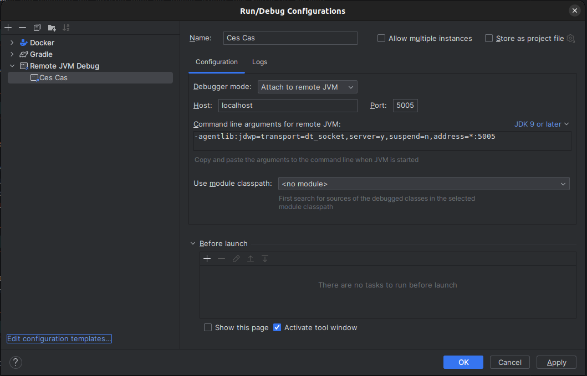

# Remote Debugging im lokalen CES

Um Verhalten des CAS gegenüber einer lokalen CES Instanz zu testen, ist es möglich, den CAS über eine Remote Debugging
zu analysieren. Im folgenden Abschnitt werden die Schritte beschrieben, um das Remote Debugging zu ermöglichen. 

## Anpassungen im CAS Repository

Um den CAS im Debugging Modus zu starten, müssen folgenden Änderungen in `resources` Verzeichnis vorgenommen werden:
* `resources/opt/apache-tomcat/bin/setenv.sh` um den Eintrag `JPDA_OPTS="-agentlib:jdwp=transport=dt_socket,address=*:8000,server=y,suspend=n"` ergänzen.
  Hiermit wird eine Debugging Session auf Port 8000 gestartet.
* `resources/startup.sh` den Eintrag `${CATALINA_SH} run` zu `${CATALINA_SH} jpda run` ändern.

## Debug in Classic CES
Um den CAS im Classic CES zu debuggen, müssen folgende Schritte durchgeführt werden.

### Hinzufügen des Port-Mappings im bestehenden Container

Mit den oben beschriebenen Anpassungen kann der CAS wie gewohnt im lokalen CES gebaut und ausgeführt werden. Initial
horcht der Container auf den internen Port 8080, stellt jedoch kein Port-Mapping nach außen bereit. Um das Remote
Debugging starten zu können, muss der oben genutzte Port 8000 von außen erreichbar sein. Hierfür muss zunächst die ID
des Containers bekannt sein:

```bash
   docker inspect --format="{{.Id}}" cas
```

Anschließend wird der Container mit cesapp gestoppt:

```bash
   cesapp stop cas
```

Da das Port-Mapping zu einem bereits bestehenden Container hinzugefügt wird, müssen hierfür sowohl die `hostconfig.json`
als auch die `config.v2.json` Config angepasst werden. Beide Dateien befinden sich im lokalen CES unter dem Pfad `/var/lib/docker/containers/<container-id>/`.

In `hostconfig.json` wird das eigentliche Port-Mapping hinzugefügt. Hierfür muss der Eintrag für `PortBindings` angepasst werden:

```json
{
  ...
  "PortBindings": {
    "8000/tcp":[{"HostIp":"","HostPort":"8000"}]
  },
  ...
}
```

In `config.v2.json` werden die `ExposedPorts` angegeben und müssen entsprechend um den Debugging Port ergänzt werden:

```json
{
  ...
  "Config": {
    ...
    "ExposedPorts": {
      "8080/tcp": {},
      "8000/tcp": {}
    },
    ...
}
```

Nach dem Anpassen der Dateien muss der Docker Dienst neu gestartet werden:

```bash
   systemctl restart docker
```

Mit dem Start des Docker-Dienstes werden die Configs neu eingelesen und der CAS Container kann wieder gestartet werden:

```bash
   cesapp start cas
```

### CAS Location im Nginx anpassen

Mit dem Hinzufügen des Ports-Mappings ist der CAS aktuell nicht mehr unter der URL `https://192.168.56.2/cas` erreichbar. 
Ursächlich hierfür ist eine Änderung des Pfades im Reverse Proxy nginx. Durch das exposen von zwei Ports werden mittels 
des nginx templates zwei neue Location im nginx angelegt: `/cas-8000` sowie `cas-8080`. Es gilt diese zumindest für die 
location `cas-8080` wieder zu `cas` zu ändern:

```bash
   docker exec -it nginx /bin/sh
```

Im Nginx Container die Datei `/etc/nginx/conf.d/app.conf` öffnen und die location `/cas-8080` zu `/cas` anpassen. Anschließend 
nginx neu laden:

```bash
   nginx -s reload -c /etc/nginx/nginx.conf
```

Der CAS sollte nun wieder über die Browser erreichbar sein. 

### SSH Tunnel mit lokalen Port-Forwarding starten

Um eine Verbindung von dem Entwicklerrechner (IDE) zum CAS innerhalb der VM (lokales CES) zu bekommen, wird SSH Tunnel mit lokalem 
Port-Forwarding eingerichtet, der den lokalen Port 5005 auf den Port 8000 innerhalb der VM weiterleitet. Hierfür muss der
folgende Befehl im lokalen Repository des Ecosystems ausgeführt werden: 

```bash
   ssh -L 5005:127.0.0.1:8000 -p 2222 -o UserKnownHostsFile=/dev/null -o StrictHostKeyChecking=no -o LogLevel=ERROR -o IdentitiesOnly=yes -i ./.vagrant/machines/default/virtualbox/private_key vagrant@127.0.0.1
```

Der Port 8000 in der VM ist nun über den Port 5000 auf dem Localhost (Entwicklerrechner) erreichbar.

### Hinzufügen einer Remote Debugging Run Configuration 

Als abschließender Schritt muss in der IDE, hier Intellij, im CAS Projekt nur noch eine Run Configuration für das Remote Debuggung hinzufügt 
werden.



## Debug in CES-Multinode

Um den CAS in CES-Multinode zu debuggen muss lediglich ein Port-Forward für Port 8000 auf den CAS-Pod erstellt werden.
Der Port-Forward kann mit kubectl oder mit k9s erstellt werden.

```shell
kubectl port-forward cas-6d7b47cd7b-pqprr 8000:8000
```

Anschließend kann sich der Remote-Debugger auf mit `localhost:8000` verbinden.


