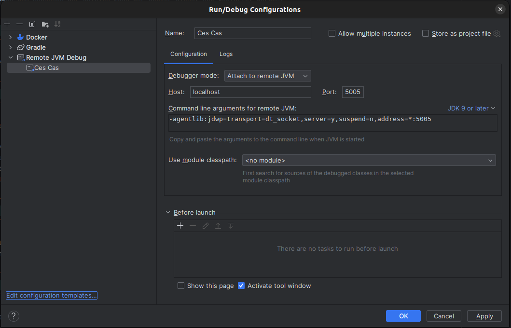

# Remote Debugging in a Local CES

To test CAS behavior against a local CES instance, you can analyze CAS via remote debugging.
The following section describes the steps required to enable remote debugging.

## Changes in the CAS Repository

To start CAS in debugging mode, the following changes must be made in the `resources` directory:
* Add the entry `JPDA_OPTS="-agentlib:jdwp=transport=dt_socket,address=*:8000,server=y,suspend=n"` to `resources/opt/apache-tomcat/bin/setenv.sh`.
  This starts a debugging session on port 8000.
* Change the entry `${CATALINA_SH} run` to `${CATALINA_SH} jpda run` in `resources/startup.sh`.

## Debugging in Classic CES

To debug CAS in Classic CES, the following steps are required.

### Add the Port Mapping to the Existing Container

With the changes described above, CAS can be built and started in the local CES as usual. Initially,
the container listens on internal port 8080, but no port mapping to the outside is exposed. To start
remote debugging, the port 8000 used above must be reachable from outside the container. To do so,
you first need to know the container ID:

```bash
docker inspect --format="{{.Id}}" cas
```

Then stop the container with `cesapp`:

```bash
cesapp stop cas
```

Since the port mapping is added to an already existing container, both `hostconfig.json`
and `config.v2.json` must be adjusted. Both files are located in the local CES at
`/var/lib/docker/containers/<container-id>/`.

In `hostconfig.json`, add the actual port mapping by adjusting the `PortBindings` entry:

```json
{
  ...
  "PortBindings": {
    "8000/tcp":[{"HostIp":"","HostPort":"8000"}]
  },
  ...
}
```

In `config.v2.json`, the `ExposedPorts` must be extended to include the debugging port:

```json
{
  ...
  "Config": {
    ...
    "ExposedPorts": {
      "8080/tcp": {},
      "8000/tcp": {}
    },
    ...
}
```

After adjusting the files, restart the Docker service:

```bash
systemctl restart docker
```

When the Docker service starts, the configuration files are reloaded and the CAS container can be started again:

```bash
cesapp start cas
```

### Adjust the CAS Location in Nginx

After adding the port mapping, CAS is no longer reachable at `https://192.168.56.2/cas`.
This is caused by a changed path in the Nginx reverse proxy. Exposing two ports causes the
Nginx template to create two new locations in Nginx: `/cas-8000` and `cas-8080`. At minimum,
the `cas-8080` location needs to be changed back to `cas`:

```bash
docker exec -it nginx /bin/sh
```

Inside the Nginx container, open `/etc/nginx/conf.d/app.conf` and change the location `/cas-8080`
to `/cas`. Then reload Nginx:

```bash
nginx -s reload -c /etc/nginx/nginx.conf
```

CAS should now be reachable again in the browser.

### Start an SSH Tunnel with Local Port Forwarding

To establish a connection from the developer machine (IDE) to CAS inside the VM (local CES),
set up an SSH tunnel with local port forwarding that forwards local port 5005 to port 8000 inside the VM.
Run the following command in the local ecosystem repository:

```bash
ssh -L 5005:127.0.0.1:8000 -p 2222 -o UserKnownHostsFile=/dev/null -o StrictHostKeyChecking=no -o LogLevel=ERROR -o IdentitiesOnly=yes -i ./.vagrant/machines/default/virtualbox/private_key vagrant@127.0.0.1
```

Port 8000 inside the VM is now reachable via port 5005 on localhost (developer machine).

### Add a Remote Debugging Run Configuration

As a final step, add a run configuration for remote debugging in the IDE, in this case IntelliJ,
for the CAS project.


