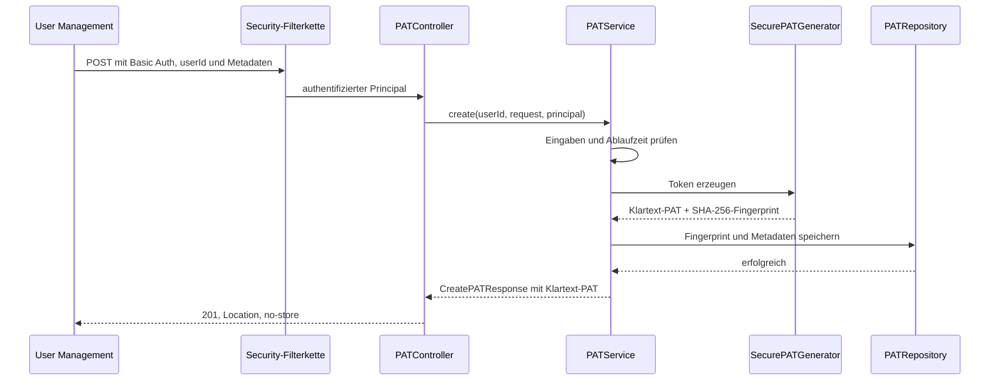

# Entwicklerdokumentation: Personal Access Tokens

## Überblick

Die Personal-Access-Token-(PAT)-Umsetzung ergänzt den CAS um eine kleine, optional aktivierbare REST-API. Über diese API kann ein vertrauenswürdiges Backend PATs für einen fachlichen Benutzer erzeugen, auflisten, lesen und löschen.

Die aktuelle Umsetzung deckt damit die **Verwaltung und sichere Ablage** von PATs ab. Sie wertet PATs noch nicht als Zugangsdaten für andere CAS-Endpunkte aus. Insbesondere gibt es derzeit keinen Authentication-Handler, der ein eingehendes PAT prüft, und keine API zur Auflösung eines PATs in einen Benutzer oder einen Scope.

Die wichtigsten Eigenschaften sind:

- Die Funktion ist standardmäßig deaktiviert.
- Die API wird mit HTTP Basic abgesichert und zustandslos betrieben.
- Der aufrufende technische Account und der fachliche Eigentümer eines PATs sind getrennte Identitäten.
- Ein Klartext-Token wird genau einmal in der Antwort auf seine Erzeugung ausgegeben.
- Persistiert wird nur ein SHA-256-Fingerprint des vollständigen Tokens.
- Lese- und Löschoperationen sind in der Persistenz immer an die Benutzer-ID gebunden.
- SQLite ist die aktuell implementierte Datenbank; die Persistenz ist für weitere Datenbankanbieter vorbereitet.
- Flyway verwaltet das PAT-Schema unabhängig von der übrigen CAS-Konfiguration.

Die Bedienung der API aus Sicht eines Clients ist unter [Personal Access Tokens über die User-Management-API](../operations/personal_access_tokens_de.md) beschrieben. Diese Seite konzentriert sich auf Aufbau, Datenfluss und Erweiterung der Implementierung.

## Systemkontext und Vertrauensgrenze

Die PAT-API ist nicht als direkte Endbenutzer-API gedacht. Vorgesehen ist ein Backend wie das User Management, das bereits eine Benutzersitzung besitzt und daraus die fachliche Benutzer-ID ermittelt.

```text
Endbenutzer
    │ authentifiziert sich am User Management
    ▼
User-Management-Backend
    │ HTTP Basic + fachliche userId im URL-Pfad
    ▼
CAS PAT-API
    │
    ├── erzeugt Token und Metadaten
    ├── protokolliert technischen Aufrufer und Eigentümer getrennt
    └── persistiert Fingerprint und Metadaten
            │
            ▼
      dedizierte PAT-Datenbank
```

Der technische Aufrufer authentifiziert sich über die global konfigurierten Spring-Security-Credentials (`spring.security.user.name` und `spring.security.user.password`). Die `userId` im Pfad bezeichnet dagegen den Eigentümer des PATs. Der Basic-Auth-Principal wird nicht automatisch zum Eigentümer.

Diese Trennung bildet zugleich die wesentliche Vertrauensgrenze: Der CAS prüft, ob der Aufrufer gültig per HTTP Basic authentifiziert ist. Er prüft aber nicht, ob dieser Aufrufer die im Pfad angegebene `userId` verwalten darf. Die korrekte Zuordnung muss daher vom aufrufenden Backend gewährleistet werden. Jeder Account, der von dieser Security-Konfiguration akzeptiert wird, kann grundsätzlich PATs für beliebige Benutzer-IDs verwalten.

Der Controller registriert intern die Pfade ohne CAS-Kontext:

```text
/api/users/{userId}/pats
/api/users/{userId}/pats/{id}
```

Im ausgelieferten CAS kommt der Kontextpfad `/cas` hinzu, sodass Clients beispielsweise `/cas/api/users/{userId}/pats` aufrufen.

## Aufbau der Implementierung

Der PAT-Code liegt hauptsächlich unter `app/src/main/java/de/triology/cas/pat`. Die Pakete sind nach ihrer Aufgabe getrennt:

| Bereich | Aufgabe |
| --- | --- |
| `config` | Bedingte Aktivierung, Bean-Aufbau, Security-Filterkette und Datenbankanbindung |
| `controller` | REST-Endpunkte und Übersetzung von Fehlern in den HTTP-Vertrag |
| `model` | Request-, Response-, Metadaten- und Persistenzmodelle |
| `service` | Fachlicher Ablauf, Validierung, Token-Erzeugung und Audit-Ereignisse |
| `repository` | Eigentümergebundene JDBC-Zugriffe |
| `config.persistence` | Abstraktion und aktuelle SQLite-Implementierung der Datenbankanbindung |

Außerhalb dieses Pakets ergänzt `de.triology.cas.logging.PATTokenRewritePolicy` die Schutzmaßnahmen gegen versehentlich protokollierte Tokenwerte. Das initiale Datenbankschema liegt unter `app/src/main/resources/db/pat/migration/sqlite`.

Die zentrale Auto-Configuration ist `PATServiceConfiguration`. Sie baut die Anwendungsschichten in dieser Reihenfolge auf:

```text
PATDatabaseProvider
        │
        ▼
   patDataSource ──► patFlyway ──► patJdbcTemplate
                                         │
                                         ▼
                                  PATRepository
                                         │
SecurePATGenerator + Clock ──────────────┤
                                         ▼
                                     PATService
                                         │
                                         ▼
                                    PATController
```

Die PAT-spezifischen Infrastruktur-Beans sind benannt und qualifiziert. DataSource, Flyway, JdbcTemplate und Clock sind keine globalen Standardkandidaten. Damit bleibt die PAT-Datenbank von möglichen anderen CAS-Datenquellen getrennt.

Sowohl `PATServiceConfiguration` als auch `PATSQLitePersistenceConfiguration` werden als Spring-Boot-Auto-Configurations registriert. Sie werden nur geladen, wenn `personal-acces-token-service.enabled=true` gesetzt ist. Bei deaktiviertem Feature werden weder Controller und Security-Filterkette noch PAT-DataSource und Migration aufgebaut.

## API-Vertrag

Die API bietet vier Operationen:

| Methode und Pfad | Verhalten | Erfolgsstatus |
| --- | --- | --- |
| `POST /api/users/{userId}/pats` | Erzeugt ein PAT und liefert den Klartext einmalig aus | `201 Created` |
| `GET /api/users/{userId}/pats` | Liefert alle Metadaten des Benutzers, neueste zuerst | `200 OK` |
| `GET /api/users/{userId}/pats/{id}` | Liefert einen Metadatensatz innerhalb der Eigentümergrenze | `200 OK` |
| `DELETE /api/users/{userId}/pats/{id}` | Löscht den Datensatz physisch | `204 No Content` |

PATs können nicht aktualisiert werden. Nicht unterstützte Methoden werden für PAT-Pfade als `405 Method Not Allowed` mit einem `Allow`-Header und dem PAT-Fehlerformat beantwortet.

### Erzeugungsdaten

Der Create-Request besteht aus:

| Feld | Bedeutung |
| --- | --- |
| `displayName` | Pflichtfeld und lesbarer Name, maximal 255 Zeichen |
| `expiresAt` | Optionaler Ablaufzeitpunkt als `Instant`; muss nach dem Erzeugungszeitpunkt liegen |
| `scope` | Optionaler, opaker Text bis 1000 Zeichen; leer oder fehlend wird zu `/*` |

Unbekannte JSON-Felder werden abgelehnt. Auch eine leere oder mehr als 255 Zeichen lange `userId` ist ungültig. Der Scope darf maximal 1000 Zeichen lang sein.

`scope` wird von diesem Modul weder interpretiert noch gegen eine Liste erlaubter Werte geprüft. `expiresAt` wird gespeichert und ausgegeben, führt aber weder zu einer automatischen Löschung noch wird es in einer Token-Authentifizierung durchgesetzt. Ein fehlender Ablaufzeitpunkt erzeugt ein nicht ablaufendes PAT.

List- und Einzelantworten enthalten ausschließlich Metadaten. Sie enthalten insbesondere weder das Klartext-Token noch dessen Fingerprint.

### Fehlerformat

Fehler werden als stabiles JSON-Objekt mit `code`, `message` und `timestamp` ausgegeben. Die wichtigsten Abbildungen sind:

| Status | Code | Typischer Grund |
| --- | --- | --- |
| `400` | `INVALID_REQUEST` | Validierungsfehler, ungültige UUID, unbekanntes Feld oder nicht lesbares JSON |
| `401` | `UNAUTHORIZED` | Fehlende oder ungültige Basic-Auth-Credentials |
| `404` | `PAT_NOT_FOUND` | PAT existiert nicht oder gehört zu einer anderen Benutzer-ID |
| `405` | `METHOD_NOT_ALLOWED` | Versuch, ein PAT zu aktualisieren oder eine andere nicht unterstützte Methode zu verwenden |
| `503` | `SERVICE_UNAVAILABLE` | Temporärer Ausfall der PAT-Persistenz |
| `500` | `INTERNAL_ERROR` | Unerwarteter interner Fehler oder inkonsistente Daten |

Die `401`-Antwort enthält zusätzlich `WWW-Authenticate: Basic realm="PAT API"`. Interne Exceptions und Datenbankdetails werden nicht an Clients weitergegeben.

## Ablauf beim Erzeugen eines PATs

Der sicherheitsrelevante Hauptablauf sieht folgendermaßen aus:



Der Generator liest 32 Zufallsbytes aus `SecureRandom` und codiert sie URL-sicher sowie ohne Base64-Padding. Das sichtbare Token beginnt mit `pat_`. Anschließend wird über das vollständige Token einschließlich Präfix ein SHA-256-Fingerprint gebildet.

Der Service kombiniert das Ergebnis mit einer zufälligen UUID, der Eigentümer-ID, den Metadaten und einem UTC-Zeitpunkt. Nur der Fingerprint und die Metadaten werden an das Repository übergeben. Nach erfolgreicher Speicherung liefert die Create-Antwort das Klartext-Token zurück. Die Antwort setzt `Cache-Control: no-store` und `Pragma: no-cache`.

Wird die Speicherung abgebrochen, wird kein Token an den Client ausgegeben. Eine erneute Anfrage erzeugt ein neues Token und eine neue ID.

## Lesen, Ownership und Löschen

Die Eigentümergrenze wird im Repository umgesetzt. Einzelabfrage und Löschung verwenden immer die Kombination aus `user_id` und `id`:

```sql
WHERE user_id = ? AND id = ?
```

Dadurch kann eine bekannte PAT-ID nicht über den Pfad eines anderen Benutzers gelesen oder gelöscht werden. Für beide Fälle liefert die API dieselbe `404`-Antwort, unabhängig davon, ob die ID nicht existiert oder einem anderen Benutzer gehört.

Die Listenoperation filtert ebenfalls nach `user_id` und sortiert nach `created_at DESC`. Sie ist aktuell nicht paginiert und filtert abgelaufene PATs nicht heraus.

Ein Delete entfernt den Datensatz direkt aus der Datenbank. Es gibt weder Soft Delete noch einen separaten Status für widerrufene Tokens. Da die aktuelle Umsetzung keine PAT-Validierung anbietet, besteht auch kein Cache, der beim Löschen invalidiert werden müsste.

## Persistenz und Migrationen

### Logisches Datenmodell

Die Tabelle `personal_access_tokens` enthält:

| Spalte | Inhalt |
| --- | --- |
| `id` | UUID des PAT-Datensatzes als Text und Primärschlüssel |
| `user_id` | Fachlicher Eigentümer |
| `display_name` | Anzeigename |
| `token_fingerprint` | 32 Byte großer SHA-256-Fingerprint |
| `created_at` | UTC-Erzeugungszeitpunkt als Text |
| `expires_at` | Optionaler UTC-Ablaufzeitpunkt als Text |
| `scope` | Opaker Scope-Text |

Ein Index auf `(user_id, created_at DESC)` unterstützt die Listenoperation. Ein weiterer Index auf `token_fingerprint` ist für eine spätere Tokenauflösung vorgesehen; die aktuelle API fragt ihn noch nicht ab.

### SQLite-Anbindung

SQLite ist über `SQLitePATDatabaseProvider` angebunden. Der Provider erkennt JDBC-URLs mit dem Präfix `jdbc:sqlite:`, erstellt die DataSource und verweist auf die passenden Flyway-Migrationen. Die Verbindung verwendet:

- WAL-Journalmodus,
- aktivierte Foreign-Key-Prüfung und
- ein Busy Timeout von fünf Sekunden.

Beim Start wählt die Konfiguration anhand der JDBC-URL genau einen `PATDatabaseProvider`. Kein oder mehr als ein passender Provider führt zu einem Startfehler. Danach migriert die dedizierte Flyway-Instanz die Datenbank, bevor das `JdbcTemplate` und das Repository verwendet werden können.

Die standardmäßige Datenbankdatei `/var/ces/config/pats.db` liegt im persistenten und backuprelevanten CAS-Volume. Für konsistente Sicherungen einer laufenden SQLite-Datenbank ist wegen des WAL-Modus auch der WAL-Zustand zu berücksichtigen.

## Security und Umgang mit Secrets

Die PAT-Pfade besitzen eine eigene Spring-Security-Filterkette. Sie wird vor der allgemeinen Basic-Auth-Konfiguration eingeordnet und hat folgende Eigenschaften:

- HTTP Basic als Authentifizierungsverfahren,
- keine serverseitige Session (`STATELESS`),
- CSRF-Schutz ausschließlich für diese zustandslose API deaktiviert,
- Zugriff nur für authentifizierte Requests und
- JSON-Antwort statt HTML-Redirect bei fehlender Authentifizierung.

Beim Aktivieren prüft die Konfiguration, dass ein Spring-Security-Benutzername und ein Passwort vorhanden sind. Sie erzwingt derzeit keine PAT-spezifische Rolle oder Authority.

Der Klartext eines PATs darf den Create-Antwortpfad nicht verlassen. Mehrere Schutzschichten reduzieren das Risiko einer versehentlichen Protokollierung:

- Die sicherheitsrelevanten Modelle maskieren Token und Fingerprint in `toString()`.
- Der Logger für Spring MVCs Request-/Response-Body-Verarbeitung ist deaktiviert.
- PAT-Logger laufen über eine Log4j-Rewrite-Policy, die PAT-Muster und Tokenfelder maskiert.
- Audit-Ereignisse enthalten IDs und Akteure, aber keine Tokenwerte oder Fingerprints.

Die Rewrite-Policy ist eine zusätzliche Absicherung und kein Ersatz für secret-sicheren Code. Neue Log-Ausgaben, Tracing-Integrationen oder Fehlerobjekte dürfen niemals den Request-/Response-Body oder das Klartext-Token übernehmen.

## Auditierung und Diagnose

Die Umsetzung verwendet den Logger `de.triology.cas.pat.audit`. Er zeichnet insbesondere folgende Ereignisse auf:

- erfolgreiche Erzeugung mit PAT-ID, Eigentümer und technischem Principal,
- fehlgeschlagene Erzeugung bei nicht verfügbarer Persistenz,
- erfolgreiche Löschung,
- fehlgeschlagene Löschung eines nicht gefundenen PATs,
- ungültige Requests und
- nicht authentifizierte Zugriffe.

`userId` und `principal` haben dabei bewusst unterschiedliche Bedeutungen. Die `userId` ist der fachliche Eigentümer aus dem Request-Pfad; `principal` ist der authentifizierte technische Aufrufer. Diese Trennung sollte bei neuen Operationen beibehalten werden.

Unerwartete Fehler werden serverseitig mit Stacktrace protokolliert, während der Client nur eine generische Meldung erhält. Bei Erweiterungen ist deshalb darauf zu achten, dass Exceptions keine Klartext-Tokens in ihrer Nachricht oder ihren Feldern tragen.

## Konfiguration und Aktivierung

Die Spring-Properties lauten:

```properties
personal-acces-token-service.enabled=false
personal-acces-token-service.database-url=jdbc:sqlite:/var/ces/config/pats.db
```

In der Dogu-Konfiguration werden sie aus folgenden Schlüsseln erzeugt:

| Dogu-/Helm-Konfiguration | Spring-Property | Standardwert |
| --- | --- | --- |
| `pat/enabled` beziehungsweise `configuration.normal.pat.enabled` | `personal-acces-token-service.enabled` | `false` |
| `pat/database_url` beziehungsweise `configuration.normal.pat.database_url` | `personal-acces-token-service.database-url` | `jdbc:sqlite:/var/ces/config/pats.db` |

Zusätzlich müssen gültige Werte für `spring.security.user.name` und `spring.security.user.password` aus der jeweiligen Laufzeitkonfiguration vorhanden sein. Fehlen sie bei aktiviertem PAT-Service, bricht der Aufbau der Security-Filterkette mit einem Startfehler ab.

## Erweiterungspunkte

### Weitere Datenbank unterstützen

Eine neue Datenbank wird über einen weiteren `PATDatabaseProvider` ergänzt. Der Provider muss die JDBC-URL eindeutig erkennen, eine passende DataSource aufbauen und ein eigenes Flyway-Verzeichnis angeben. Das logische Schema und die Semantik des Repositories müssen dabei gleich bleiben. Controller und Service sollen keine datenbankspezifischen Abhängigkeiten erhalten.

### Tokenvalidierung ergänzen

Eine spätere Verwendung der PATs als echte Zugangsdaten benötigt eine eigene Authentifizierungsstrecke. Sie muss mindestens:

1. das eingehende vollständige Token hashen,
2. den Fingerprint über eine Repository-Operation auflösen,
3. den Ablaufzeitpunkt prüfen,
4. den Eigentümer und den Scope in eine authentifizierte Identität überführen und
5. gelöschte oder unbekannte PATs einheitlich ablehnen.

Der dafür bereits persistierte Fingerprint-Index ermöglicht eine Suche, ohne Klartext-Tokens speichern zu müssen. Vergleiche von sicherheitsrelevanten Bytewerten sollten zeitkonstant erfolgen. Tokenwerte dürfen auch in diesem Pfad nicht in Logs, Metriken oder Traces erscheinen.
