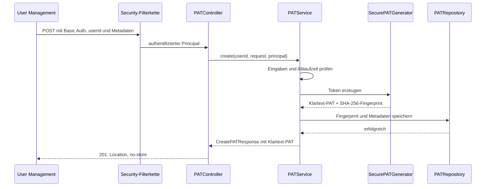

# Entwicklerdokumentation: Personal Access Tokens

## Überblick

Die Personal-Access-Token-(PAT)-Umsetzung ergänzt den CAS um eine kleine, optional aktivierbare REST-API. Über diese API kann ein vertrauenswürdiges Backend PATs für einen fachlichen Benutzer erzeugen, auflisten, lesen und löschen.

Die aktuelle Umsetzung umfasst **Verwaltung, sichere Ablage und Anmeldung** mit PATs. `PATAuthenticationHandler` prüft Token und Eigentümer; `PATServiceTicketFactory` begrenzt Service-Tickets anhand des gespeicherten Scopes. Ein Beispiel für den vollständigen API-Zugriff folgt im Abschnitt „Praktischer Anmeldefall: Usermgt-API mit PAT“.

Die wichtigsten Eigenschaften sind:

- Die Funktion ist standardmäßig deaktiviert.
- Die API wird mit HTTP Basic abgesichert und zustandslos betrieben.
- Der aufrufende technische Account und der fachliche Eigentümer eines PATs sind getrennte Identitäten.
- Ein Klartext-Token wird genau einmal in der Antwort auf seine Erzeugung ausgegeben.
- Persistiert wird nur ein SHA-256-Fingerprint des vollständigen Tokens.
- Lese- und Löschoperationen sind in der Persistenz immer an die Benutzer-ID gebunden.
- SQLite ist die aktuell implementierte Datenbank; die Persistenz ist für weitere Datenbankanbieter vorbereitet.
- Flyway verwaltet das PAT-Schema unabhängig von der übrigen CAS-Konfiguration.

## Systemkontext und Vertrauensgrenze

Die PAT-API ist nicht als direkte Endbenutzer-API gedacht. Vorgesehen ist ein Backend wie das User Management, das bereits eine Benutzersitzung besitzt und daraus die fachliche Benutzer-ID ermittelt.

```text
Endbenutzer
    │ authentifiziert sich am User Management
    ▼
User-Management-Backend
    │ HTTP Basic + fachliche userId im URL-Pfad
    ▼
CAS PAT-API
    │
    ├── erzeugt Token und Metadaten
    ├── protokolliert technischen Aufrufer und Eigentümer getrennt
    └── persistiert Fingerprint und Metadaten
            │
            ▼
      dedizierte PAT-Datenbank
```

Der technische Aufrufer authentifiziert sich über die global konfigurierten Spring-Security-Credentials (`spring.security.user.name` und `spring.security.user.password`). Die `userId` im Pfad bezeichnet dagegen den Eigentümer des PATs.

Diese Trennung bildet zugleich die wesentliche Vertrauensgrenze: Der CAS prüft, ob der Aufrufer gültig per HTTP Basic authentifiziert ist. Er prüft aber nicht, ob dieser Aufrufer die im Pfad angegebene `userId` verwalten darf. Die korrekte Zuordnung muss daher vom aufrufenden Backend gewährleistet werden. Jeder Account, der von dieser Security-Konfiguration akzeptiert wird, kann grundsätzlich PATs für beliebige Benutzer-IDs verwalten.

Die Pfade werden wie folgt registriert

```text
/cas/api/users/{userId}/pats
/cas/api/users/{userId}/pats/{id}
```

## Aufbau der Implementierung

Der PAT-Code liegt hauptsächlich unter `app/src/main/java/de/triology/cas/pat`. Die Pakete sind nach ihrer Aufgabe getrennt:

| Bereich | Aufgabe |
| --- | --- |
| `config` | Bedingte Aktivierung, Bean-Aufbau, Security-Filterkette und Datenbankanbindung |
| `controller` | REST-Endpunkte und Übersetzung von Fehlern in den HTTP-Vertrag |
| `model` | Request-, Response-, Metadaten- und Persistenzmodelle |
| `service` | Fachlicher Ablauf, Validierung, Token-Erzeugung und Audit-Ereignisse |
| `repository` | Eigentümergebundene JDBC-Zugriffe |
| `config.persistence` | Abstraktion und aktuelle SQLite-Implementierung der Datenbankanbindung |

Außerhalb dieses Pakets ergänzt `de.triology.cas.logging.PATTokenRewritePolicy` die Schutzmaßnahmen gegen versehentlich protokollierte Tokenwerte. Das initiale Datenbankschema liegt unter `app/src/main/resources/db/pat/migration/sqlite`.

Die zentrale Auto-Configuration ist `PATServiceConfiguration`. Sie baut die Anwendungsschichten in dieser Reihenfolge auf:

```text
PATDatabaseProvider
        │
        ▼
   patDataSource ──► patFlyway ──► patJdbcTemplate
                                         │
                                         ▼
                                  PATRepository
                                         │
SecurePATGenerator + Clock ──────────────┤
                                         ▼
                                     PATService
                                         │
                                         ▼
                                    PATController
```

## API-Vertrag

Die API bietet vier Operationen:

| Methode und Pfad | Verhalten | Erfolgsstatus |
| --- | --- | --- |
| `POST /api/users/{userId}/pats` | Erzeugt ein PAT und liefert den Klartext einmalig aus | `201 Created` |
| `GET /api/users/{userId}/pats` | Liefert alle Metadaten des Benutzers, neueste zuerst | `200 OK` |
| `GET /api/users/{userId}/pats/{id}` | Liefert einen Metadatensatz innerhalb der Eigentümergrenze | `200 OK` |
| `DELETE /api/users/{userId}/pats/{id}` | Löscht den Datensatz physisch | `204 No Content` |

PATs können nicht aktualisiert werden. Nicht unterstützte Methoden werden für PAT-Pfade als `405 Method Not Allowed` mit einem `Allow`-Header und dem PAT-Fehlerformat beantwortet.

### Erzeugungsdaten

Der Create-Request besteht aus:

| Feld | Bedeutung |
| --- | --- |
| `displayName` | Pflichtfeld und lesbarer Name, maximal 255 Zeichen |
| `expiresAt` | Optionaler Ablaufzeitpunkt als `Instant`; muss nach dem Erzeugungszeitpunkt liegen |
| `scope` | Optionale, kommagetrennte Service-Pfade bis 1000 Zeichen; leer oder fehlend wird zu `/*` |

Unbekannte JSON-Felder werden abgelehnt. Auch eine leere oder mehr als 255 Zeichen lange `userId` ist ungültig. Der Scope darf maximal 1000 Zeichen lang sein.

`scope` wird beim Erstellen nicht gegen eine Liste erlaubter Werte geprüft. Bei der Ausstellung eines Service-Tickets werden die enthaltenen Pfade ausgewertet. Ein fehlender Ablaufzeitpunkt erzeugt ein nicht ablaufendes PAT.

List- und Einzelantworten enthalten ausschließlich Metadaten. Sie enthalten insbesondere weder das Klartext-Token noch dessen Fingerprint.

### Fehlerformat

Fehler werden als JSON-Objekt mit `code`, `message` und `timestamp` ausgegeben. Die wichtigsten Abbildungen sind:

| Status | Code | Typischer Grund |
| --- | --- | --- |
| `400` | `INVALID_REQUEST` | Validierungsfehler, ungültige UUID, unbekanntes Feld oder nicht lesbares JSON |
| `401` | `UNAUTHORIZED` | Fehlende oder ungültige Basic-Auth-Credentials |
| `404` | `PAT_NOT_FOUND` | PAT existiert nicht oder gehört zu einer anderen Benutzer-ID |
| `405` | `METHOD_NOT_ALLOWED` | Versuch, ein PAT zu aktualisieren oder eine andere nicht unterstützte Methode zu verwenden |
| `503` | `SERVICE_UNAVAILABLE` | Temporärer Ausfall der PAT-Persistenz |
| `500` | `INTERNAL_ERROR` | Unerwarteter interner Fehler oder inkonsistente Daten |

Die `401`-Antwort enthält zusätzlich `WWW-Authenticate: Basic realm="PAT API"`. Interne Exceptions und Datenbankdetails werden nicht an Clients weitergegeben.

## Ablauf beim Erzeugen eines PATs

Der sicherheitsrelevante Hauptablauf sieht folgendermaßen aus:



Der Generator liest 32 Zufallsbytes aus `SecureRandom` und codiert sie URL-sicher sowie ohne Base64-Padding. Das sichtbare Token beginnt mit `pat_`. Anschließend wird über das vollständige Token einschließlich Präfix ein SHA-256-Fingerprint gebildet.

Der Service kombiniert das Ergebnis mit einer zufälligen UUID, der Eigentümer-ID, den Metadaten und einem UTC-Zeitpunkt. Nur der Fingerprint und die Metadaten werden an das Repository übergeben. Nach erfolgreicher Speicherung liefert die Create-Antwort das Klartext-Token zurück. Die Antwort setzt `Cache-Control: no-store` und `Pragma: no-cache`.

## Praktischer Anmeldefall: Usermgt-API mit PAT

Dieses Beispiel liest das eigene Benutzerkonto über `GET /usermgt/api/account`. Es benötigt keine Administratorrolle und prüft den vollständigen Weg vom API-Client über CAS bis zur Antwort des Dogus. Die Befehle werden im CAS-Repository in derselben Bash-Sitzung ausgeführt. Das vorhandene Skript heißt [pat-tests.sh](pat-tests.sh).

### 1. Voraussetzungen

CAS benötigt `pat/enabled=true`, einen erreichbaren LDAP-Benutzer und die technischen API-Zugangsdaten. Im Dogu-Template stammen diese aus den verschlüsselten Schlüsseln `experimental/totp/api_user_name` und `experimental/totp/api_user_password`, auch wenn TOTP deaktiviert ist. Nach Änderungen CAS neu starten. Usermgt muss erreichbar und seine konfigurierte CAS-Service-URL in CAS zugelassen sein; deren Pfad muss vom Scope `/usermgt` abgedeckt werden.

Ohne 2FA gilt `experimental/totp/activate=false`. Mit 2FA gilt `experimental/totp/activate=true`; das CAS-Template setzt dann den GAuth-Bypass auf das Principal-Attribut `patAuthentication` mit Wert `true`. Die PAT-Anmeldung benötigt dadurch keinen TOTP-Code. Ein frischer regulärer Browser-Login mit Benutzerpasswort verlangt weiterhin TOTP. Die API-Credentials in Usermgt selbst sind für die Verwaltung von PATs über die Oberfläche nötig, nicht für diesen Basic-Auth-Aufruf mit einem bereits erstellten PAT.

### 2. Token mit dem Verwaltungsskript erstellen

```bash
export CAS_URL='https://ces.example.org/cas'
export USERMGT_URL='https://ces.example.org/usermgt'
export USER_ID='<LDAP-BENUTZERNAME>'
export SA_USER='<TECHNISCHER-API-BENUTZER>'
read -r -s -p 'Technisches API-Passwort: ' SA_PASSWORD
export SA_PASSWORD

bash docs/development/pat-tests.sh create \
  --scope /usermgt --displayname 'Usermgt API Login'
```

Erwartet wird `201 Created`. Aus dem JSON die `id` für die spätere Löschung und den vollständigen `token` einschließlich `pat_` übernehmen. `USER_ID` muss exakt dem Token-Eigentümer entsprechen. Das Skript benötigt Bash, curl und jq; es verwendet für Entwicklungsinstanzen `curl -k` und deaktiviert damit die TLS-Zertifikatsprüfung. Die folgenden direkten curl-Aufrufe prüfen das Zertifikat; bei einer privaten CA `--cacert /pfad/zur/ca.pem` ergänzen.

```bash
export PAT_ID='<ID-AUS-DER-CREATE-ANTWORT>'
read -r -s -p 'Vollständiges PAT: ' PAT_TOKEN
```

### 3. Tatsächlichen API-Aufruf mit PAT ausführen

```bash
curl --fail-with-body --silent --show-error --include \
  --basic --user "$USER_ID:$PAT_TOKEN" \
  --header 'Accept: application/json' \
  "$USERMGT_URL/api/account"
```

Hier ist das Passwortfeld das PAT, und der Benutzername ist der LDAP-Benutzer. `SA_USER` und `SA_PASSWORD` werden ausschließlich für die Verwaltung verwendet. Ein `Authorization: Bearer`-Header ist für diesen Anmeldeweg nicht vorgesehen. Der Aufruf sendet keine vorhandenen Sitzungscookies und folgt keinen Login-Redirects.

Erwartet wird `200 OK` mit dem eigenen Benutzerkonto als JSON. Eine HTML-Loginseite oder ein Redirect ist kein erfolgreicher API-Login. Intern passiert Folgendes:

1. Usermgt übernimmt die Basic-Auth-Zugangsdaten in `CasRestAuthenticationRealm`.
2. `CasRestClient` sendet `username` und das PAT als `password` an `POST /cas/v1/tickets`. CAS prüft Fingerprint, Ablauf und Eigentümer und löst den Benutzer über LDAP auf. Die erfolgreiche Antwort enthält `201` und die TGT-URL im `Location`-Header.
3. Usermgt fordert mit diesem TGT ein Service-Ticket für seine konfigurierte `CasConfiguration.service`-URL an. CAS prüft deren Pfad gegen `patScope` und liefert bei Erfolg `200` mit dem Service-Ticket.
4. Usermgt validiert das Ticket über `Saml11TicketValidator`, übernimmt den bestätigten Principal und liefert das eigene Benutzerkonto aus.

Der Scope gilt für die konfigurierte CAS-Service-URL, nicht für jeden REST-Endpunkt einzeln. `/usermgt` deckt diesen Pfad und Unterpfade ab, aber nicht `/usermgt-other`. Es ersetzt keine Benutzerrechte: Ein Aufruf von `/usermgt/api/users` benötigt beispielsweise weiterhin die Administratorrolle. Deshalb verwendet dieses Beispiel `/api/account`.

### 4. Ablehnung und Löschung prüfen

Für einen Scope-Negativtest ein zweites PAT mit `--scope /redmine` erstellen und denselben Usermgt-Aufruf damit wiederholen. Die Ausstellung des Usermgt-Service-Tickets muss scheitern. Ebenfalls testen: falscher Benutzername und abgelaufenes PAT. Den konkreten Fehlerstatus anhand der Dogu-Antwort prüfen; das JSON-Fehlerformat der PAT-Verwaltungs-API gilt nicht automatisch für diese Anmeldestrecke.

Anschließend das ursprüngliche PAT löschen und denselben API-Aufruf ohne Sitzungscookies wiederholen:

```bash
bash docs/development/pat-tests.sh delete "$PAT_ID"

# Erwartet: kein erfolgreicher Zugriff auf das Benutzerkonto mehr.
curl --fail-with-body --silent --show-error --include \
  --basic --user "$USER_ID:$PAT_TOKEN" \
  --header 'Accept: application/json' \
  "$USERMGT_URL/api/account"

unset PAT_TOKEN SA_PASSWORD
```

Das Löschen liefert `204`. Die neue Anmeldung muss scheitern; bereits ausgestellte Tickets oder bestehende Sitzungen werden durch die Löschung nicht aktiv widerrufen. Den vollständigen Fall jeweils mit deaktiviertem und aktiviertem TOTP testen. `pat-tests.sh invalid-auth` prüft dagegen nur falsche technische Zugangsdaten an der Verwaltungs-API.

## Lesen, Ownership und Löschen

Die Eigentümergrenze wird im Repository umgesetzt. Einzelabfrage und Löschung verwenden immer die Kombination aus `user_id` und `id`:

```sql
WHERE user_id = ? AND id = ?
```

Dadurch kann eine bekannte PAT-ID nicht über den Pfad eines anderen Benutzers gelesen oder gelöscht werden. Für beide Fälle liefert die API dieselbe `404`-Antwort, unabhängig davon, ob die ID nicht existiert oder einem anderen Benutzer gehört.

Die Listenoperation filtert ebenfalls nach `user_id` und sortiert nach `created_at DESC`. Sie ist aktuell nicht paginiert und filtert abgelaufene PATs nicht heraus.

Ein Delete entfernt den Datensatz direkt aus der Datenbank. Es gibt weder Soft Delete noch einen separaten Status für widerrufene Tokens.

## Persistenz und Migrationen

### Logisches Datenmodell

Die Tabelle `personal_access_tokens` enthält:

| Spalte | Inhalt |
| --- | --- |
| `id` | UUID des PAT-Datensatzes als Text und Primärschlüssel |
| `user_id` | Fachlicher Eigentümer |
| `display_name` | Anzeigename |
| `token_fingerprint` | 32 Byte großer SHA-256-Fingerprint |
| `created_at` | UTC-Erzeugungszeitpunkt als Text |
| `expires_at` | Optionaler UTC-Ablaufzeitpunkt als Text |
| `scope` | Kommagetrennte Service-Pfade |

Ein Index auf `(user_id, created_at DESC)` unterstützt die Listenoperation. Ein weiterer Index auf `token_fingerprint` unterstützt die Tokenauflösung bei der PAT-Anmeldung.

### SQLite-Anbindung

SQLite ist über `SQLitePATDatabaseProvider` angebunden. Der Provider erkennt JDBC-URLs mit dem Präfix `jdbc:sqlite:`, erstellt die DataSource und verweist auf die passenden Flyway-Migrationen. Die Verbindung verwendet:

- WAL-Journalmodus,
- aktivierte Foreign-Key-Prüfung und
- ein Busy Timeout von fünf Sekunden.

Beim Start wählt die Konfiguration anhand der JDBC-URL genau einen `PATDatabaseProvider`. Kein oder mehr als ein passender Provider führt zu einem Startfehler. Danach migriert die dedizierte Flyway-Instanz die Datenbank, bevor das `JdbcTemplate` und das Repository verwendet werden können.

Die standardmäßige Datenbankdatei `/var/ces/config/pats.db` liegt im persistenten und backuprelevanten CAS-Volume. Für konsistente Sicherungen einer laufenden SQLite-Datenbank ist wegen des WAL-Modus auch der WAL-Zustand zu berücksichtigen.

## Security und Umgang mit Secrets

Die PAT-Pfade besitzen eine eigene Spring-Security-Filterkette. Sie wird vor der allgemeinen Basic-Auth-Konfiguration eingeordnet und hat folgende Eigenschaften:

- HTTP Basic als Authentifizierungsverfahren,
- keine serverseitige Session (`STATELESS`),
- CSRF-Schutz ausschließlich für diese zustandslose API deaktiviert,
- Zugriff nur für authentifizierte Requests und
- JSON-Antwort statt HTML-Redirect bei fehlender Authentifizierung.

Beim Aktivieren prüft die Konfiguration, dass ein Spring-Security-Benutzername und ein Passwort vorhanden sind. Sie erzwingt derzeit keine PAT-spezifische Rolle oder Authority.

Die Verwaltungs-API liefert den Klartext eines PATs ausschließlich in der Create-Antwort aus. Für die spätere Anmeldung übergibt der Client diesen Klartext als Passwort; er darf dabei nicht protokolliert werden. Mehrere Schutzschichten reduzieren das Risiko einer versehentlichen Protokollierung:

- Die sicherheitsrelevanten Modelle maskieren Token und Fingerprint in `toString()`.
- Der Logger für Spring MVCs Request-/Response-Body-Verarbeitung ist deaktiviert.
- PAT-Logger laufen über eine Log4j-Rewrite-Policy, die PAT-Muster und Tokenfelder maskiert.
- Audit-Ereignisse enthalten IDs und Akteure, aber keine Tokenwerte oder Fingerprints.

Die Rewrite-Policy ist eine zusätzliche Absicherung und kein Ersatz für secret-sicheren Code. Neue Log-Ausgaben, Tracing-Integrationen oder Fehlerobjekte dürfen niemals den Request-/Response-Body oder das Klartext-Token übernehmen.

## Auditierung und Diagnose

Die Umsetzung verwendet den Logger `de.triology.cas.pat.audit`. Er zeichnet insbesondere folgende Ereignisse auf:

- erfolgreiche Erzeugung mit PAT-ID, Eigentümer und technischem Principal,
- fehlgeschlagene Erzeugung bei nicht verfügbarer Persistenz,
- erfolgreiche Löschung,
- fehlgeschlagene Löschung eines nicht gefundenen PATs,
- ungültige Requests und
- nicht authentifizierte Zugriffe.

`userId` und `principal` haben dabei bewusst unterschiedliche Bedeutungen. Die `userId` ist der fachliche Eigentümer aus dem Request-Pfad; `principal` ist der authentifizierte technische Aufrufer. Diese Trennung sollte bei neuen Operationen beibehalten werden.

Unerwartete Fehler werden serverseitig mit Stacktrace protokolliert, während der Client nur eine generische Meldung erhält. Bei Erweiterungen ist deshalb darauf zu achten, dass Exceptions keine Klartext-Tokens in ihrer Nachricht oder ihren Feldern tragen.

## Konfiguration und Aktivierung

Die Spring-Properties lauten:

```properties
personal-acces-token-service.enabled=false
personal-acces-token-service.database-url=jdbc:sqlite:/var/ces/config/pats.db
```

In der Dogu-Konfiguration werden sie aus folgenden Schlüsseln erzeugt:

| Dogu-/Helm-Konfiguration | Spring-Property | Standardwert |
| --- | --- | --- |
| `pat/enabled` beziehungsweise `configuration.normal.pat.enabled` | `personal-acces-token-service.enabled` | `false` |
| `pat/database_url` beziehungsweise `configuration.normal.pat.database_url` | `personal-acces-token-service.database-url` | `jdbc:sqlite:/var/ces/config/pats.db` |

Zusätzlich müssen gültige Werte für `spring.security.user.name` und `spring.security.user.password` aus der jeweiligen Laufzeitkonfiguration vorhanden sein. Fehlen sie bei aktiviertem PAT-Service, bricht der Aufbau der Security-Filterkette mit einem Startfehler ab.

## Erweiterungspunkte

### Weitere Datenbank unterstützen

Eine neue Datenbank wird über einen weiteren `PATDatabaseProvider` ergänzt. Der Provider muss die JDBC-URL eindeutig erkennen, eine passende DataSource aufbauen und ein eigenes Flyway-Verzeichnis angeben. Das logische Schema und die Semantik des Repositories müssen dabei gleich bleiben. Controller und Service sollen keine datenbankspezifischen Abhängigkeiten erhalten.

### Authentifizierungsstrecke erweitern

`PATAuthenticationHandler` löst den Fingerprint auf, prüft den Ablaufzeitpunkt und den angegebenen Eigentümer und lädt den Principal über LDAP. Er setzt `patScope` und `patAuthentication=true`. `PATServiceTicketFactory` prüft den Service-URL-Pfad gegen den Scope im TGT. Tokenwerte dürfen auch in diesem Pfad nicht in Logs, Metriken oder Traces erscheinen.

Bei Anpassungen an der Principal-Auflösung müssen die PAT-Attribute erhalten bleiben: Ohne `patScope` als Liste mit einem String an erster Stelle delegiert die Ticket-Factory ohne PAT-Scope-Prüfung an CAS. Löschen oder Ablauf verhindert neue PAT-Anmeldungen, widerruft aber keine bestehenden Tickets oder Dogu-Sitzungen. Bei der Service-Ticket-Ausstellung wird die Gültigkeit des Tokens nicht erneut in der Datenbank geprüft.
