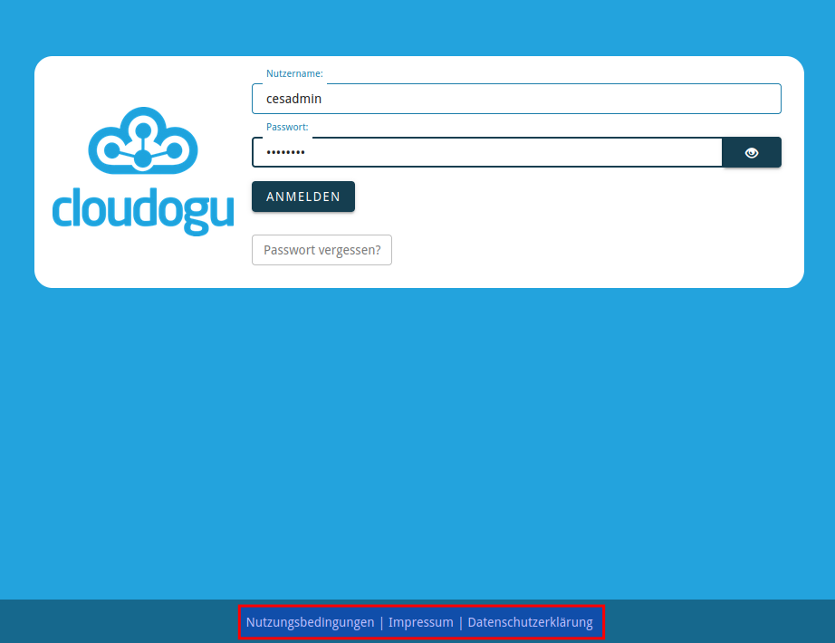

# Anpassung von konfigurierbaren Texten
Bestimmte Textfelder für Nachrichten und eigene URLs lassen sich im CAS Dogu per etcd-Schlüssel individuell anpassen. 
In der Standardkonfiguration des CAS sind diese Schlüssel nicht enthalten. Das Setzen der Schlüssel sorgt dafür, dass die UI Elemente erst gerendert werden. Sind die Schlüssel nicht gesetzt werden bestimmte UI Elemente auch nicht angezeigt.

Zu den konfigurierbaren Schlüsseln gehören die URLs für **Nutzungsbedingungen**, **Impressum** und **Datenschutzerklärung** sowie ein Text der angezeigt wird, wenn auf den `Passwort vergessen` Button geklickt wird (Der `Passwort vergessen` Button ist in der Standardkonfiguration ausgeblendet. Das setzen des Textes aktiviert ebenfalls den Button in der UI).

## Konfiguration von rechtlichen Links
In der Standardkonfiguration des CAS Dogus werden auf der Login-Seite keine rechtlichen Links angezeigt. Es können allerdings Links für **Nutzungsbedingungen**, **Impressum** und **Datenschutzerklärung** hinterlegt werden.
* **Nutzungsbedingungen** - setzen des etcd Schlüssels `etcdctl set /config/cas/legal_urls/terms_of_service "https://.../tos..."`
* **Impressum** - setzen des etcd Schlüssels `etcdctl set /config/cas/legal_urls/imprint "https://.../imprint..."`
* **Datenschutzerklärung** - setzen des etcd Schlüssels `etcdctl set /config/cas/legal_urls/privacy_policy "https://.../privacy_policy..."`
Das Setzten der etcd-Schlüssel aktiviert auch die entsprechenden UI Elemente in der Fußleiste der Login Maske.

## Konfiguration des Textes für vergessenes Passwort

Es kann eine Benutzerdefinierte Nachricht angezeigt werden, die erscheint, 
wenn auf `Passwort vergessen?` geklickt wird. Dort können Informationen hinterlegt 
werden, wie ein Nutzer damit umgehen soll, wenn dieser sein Passwort vergessen hat.

Dafür muss nur der etcd key `config/cas/forgot_password_text` auf den gewünschten Wert
gesetzt werden und das CAS Dogu neu gestartet werden. Der Text kann nun in der Login Maske
durch einen Klick auf "Passwort vergessen?" ein- und ausgeblendet werden.

Beachte, dass der `Passwort vergessen`-Button nur angezeigt wird, wenn die Passwort-Zurücksetzen-Funktion deaktiviert ist 
(s. [Deaktivierung der Passwort-Zurücksetzen-Funktion](password-management_de.md#deaktivierung-der-passwort-zurcksetzen-funktion))
und dem etcd key `config/cas/forgot_password_text` ein Wert zugewiesen worden ist.