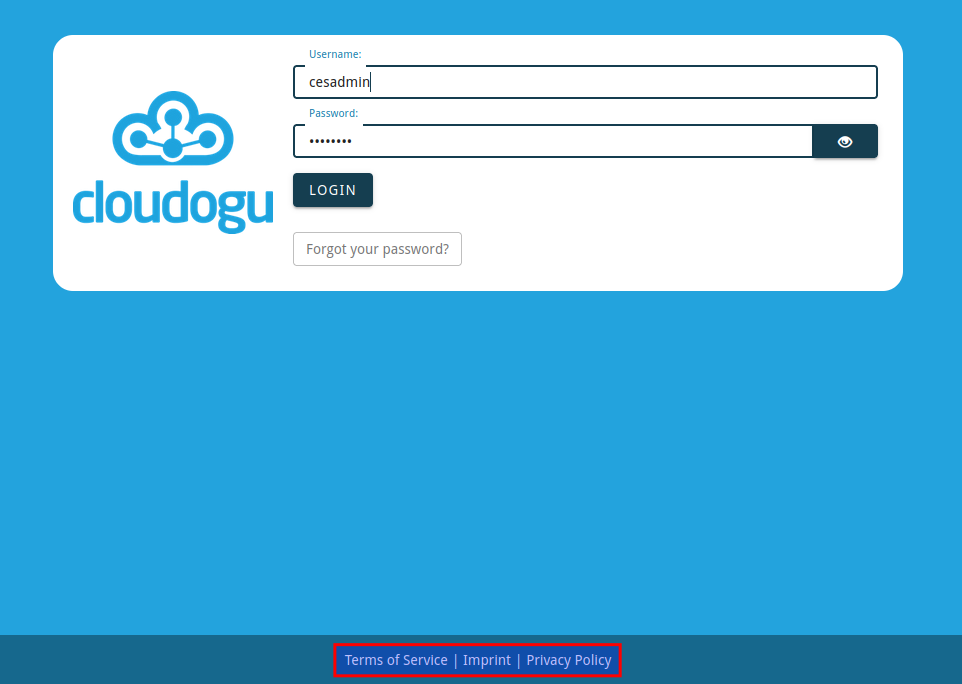

# Customization of configurable texts
Certain text fields for messages and custom URLs can be customized in CAS dogu using etcd keys.
The default configuration of the CAS does not include these keys. Setting the keys ensures that the UI elements are rendered.
If the keys are not set, these UI elements are not displayed.

The configurable keys include the URLs for **Terms of Service**, **Imprint** and **Privacy Policy** as well as a text that is displayed when the `Forget Password` button is clicked (The `Forget Password` button is hidden in the default configuration). Setting the text will also activate the button in the UI).

## Configuration of legal links 
In the default configuration of CAS dogu, no legal links are displayed on the login page. However, links for **Terms of Service**, **Imprint** and **Privacy Policy** can be stored.
* **Terms of Service** - set the etcd key `etcdctl set /config/cas/legal_urls/terms_of_service "https://.../tos..."`.
* **Imprint** - set etcd key `etcdctl set /config/cas/legal_urls/imprint "https://.../imprint..."`
* **Privacy policy** - set etcd key `etcdctl set /config/cas/legal_urls/privacy_policy "https://.../privacy_policy..."`
 
Setting the etcd key also activates the corresponding UI elements in the footer of the login screen.

## Configuration of the text for forgotten password

A custom message can be displayed, which appears
when `forgotten password?` is clicked. There information can be stored
how a user should handle it if he has forgotten his password.

For this only the etcd key `config/cas/forgot_password_text` must be set to the desired value and the CAS Dogu new
and restart the CAS Dogu. The text can now be changed in the login screen
by clicking on "Forgot password?".

Note that the `Forgot Password` button is only displayed if the password reset function is deactivated 
(see [Deactivating the password reset function](password-management_en.md#deactivating-the-password-reset-function)) and a value has 
been assigned to the etcd key `config/cas/forgot_password_text`.