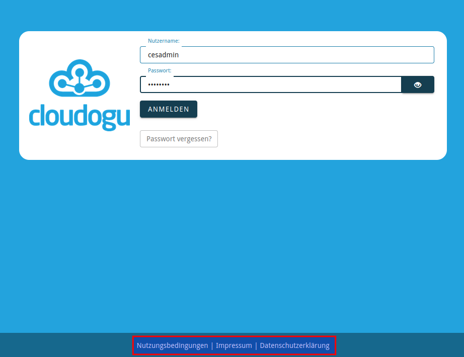

# Customizing Configurable Texts
Certain text fields for messages and custom URLs can be customized in the CAS Dogu via etcd keys.
These keys are not included in the default CAS configuration. Setting the keys ensures that the UI elements are rendered in the first place. If the keys are not set, certain UI elements are not displayed.

The configurable keys include the URLs for **Terms of Service**, **Imprint**, and **Privacy Policy**, as well as a text that is displayed when the `Forgot password` button is clicked (the `Forgot password` button is hidden in the default configuration. Setting the text also enables the button in the UI).

## Configuration of Legal Links
In the default configuration of the CAS Dogu, no legal links are displayed on the login page. However, links for **Terms of Service**, **Imprint**, and **Privacy Policy** can be stored.
Setting the etcd keys also activates the corresponding UI elements in the footer of the login form.

* ``kubectl edit -n ecosystem configmap cas-config``
* ```yaml
    data:
      config.yaml: |
        legal_urls:
          terms_of_service: "https://.../tos..."
          imprint: "https://.../imprint..."
          privacy_policy: "https://.../privacy_policy..."
  ```

**Warning**
If a URL without a protocol (for example `www.test.de`) is set as a `legal_url`, CAS automatically prepends the FQDN to the link. The URL is then set as follows:
```https://{fqdn}/cas/www.test.de```.
If an external URL should be displayed as a `legal_url`, the protocol must also be specified (for example `https://www.test.de`).




## Configuration of the Text for Forgotten Passwords

A custom message can be displayed when `Forgot password?` is clicked.
Information can be stored there about what a user should do if they have forgotten their password.

To do this, the configuration key only needs to be set to the desired value
and the CAS Dogu restarted. The text can then be shown and hidden in the login form
by clicking "Forgot password?".

Note that the `Forgot password` button is only displayed if the password reset function is disabled
(see [Disabling the password reset function](password-management_en.md#disabling-the-password-reset-function))
and a value has been assigned to the configuration key.

* ``kubectl edit -n ecosystem configmap cas-config``
* ```yaml
    data:
      config.yaml:
        forgot_password_text: "Your text..."
  ```
