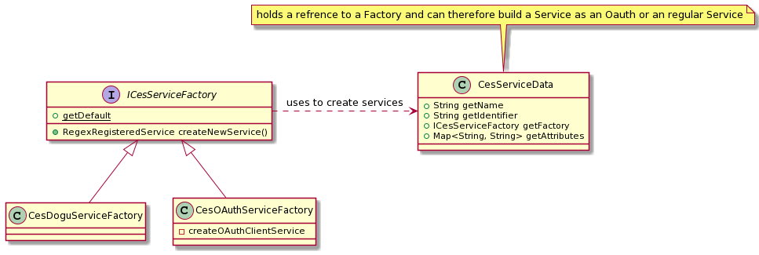

# OAuth
Für die Implementierung von OAuth wurde das vorhandenen OAuth Plugin von CAS eingebunden.

Wir benutzen zur Erstellung der Services im CAS einen eigenen ServiceManager ausschließlich für Dogu-Services. 
Dieser wurde um das Interface `ICESServiceFactory` erweitert um die Erstellung verschiedene Arten von Services leicht und einfach austauschbar zu realisieren.

Ausgehend davon werden in den beiden Stages `CesServicesManagerStageDevelopment` und `CesServicesManagerStageProductive` 
die neuen Factories die das Interface `ICESServiceFactory` implementiert genutzt um Services für OAuth, PersistantServices 
und DoguServices zu erstellen.
Neu ist ebenfalls das Package [de.triology.cas.services.oauth](../app/src/main/java/de/triology/cas/services/oauth). 
Die enthaltenden Controller verwalten die Requests an die Endpunkte für OAuth-Requests 
([/authorize](oauth/endpoint_authorize.md), [/accessToken](oauth/endpoint_accessToken.md), [/profile](oauth/endpoint_profile.md)). 
Um alle nötigen Informationen zu sammeln wurde außerdem die Klasse `RegestryEtcd` dahingehend erwetert, 
dass die Informationen die für OAuth Services benötigt werden (ClientId und Secret-Hash) aus dem etcd ausgelesen werden können.

