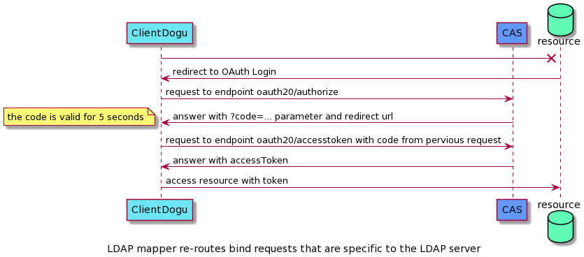

# CAS als OAuth Provider benutzen

CAS bietet OAuth als Protokoll zur Authentifizierung samt SSO/SSL an. 
Im Folgenden werden die Spezifikation des OAuth Protokolls in CAS beschrieben.

## OAuth Service Account für Dogu erstellen

Damit ein Dogu die OAuth-Endpunkte des CAS benutzen kann, muss sich dieser beim CAS als OAuth Client anmelden.
Dafür kann die Aufforderung eines CAS-Service Account in der `dogu.json` des betreffenden Dogus hinterlegt werden.
``` json
"ServiceAccounts": [
    {
        "Type": "cas"
    }
]
```

Die Credentials des Service Accounts werden zufällig generiert (siehe [create-sa.sh](../resources/create-sa.sh)) 
und verschlüsselt im etcd unter dem Pfad `/config/<dogu>/sa-cas/oauth_client_id` und `/config/<dogu>/sa-cas/oauth_client_secret` hinterlegt.
Die credentials setzten sich aus der `CLIENT_ID` und dem `CLIENT_SECRET` zusammen. 
Für den CAS wird das `CLIENT_SECRET` als Hash im __etcd__ unter dem Pfad `/config/cas/service_accounts/<CLIENT_ID>` abgelegt.

### OAuth Endpunkte und Ablauf

Die folgenden Schritte beschreiben einen erfolgreichen Ablauf der OAuth-Authentifizierung. 

1. Anfordern eines Kurzzeit-Tokens: [Authorize-Endpunkt](oauth/endpoint_authorize.md)
2. Kurzzeittoken gegen ein Langzeittoken tauschen: [AccessToken-Endpunkt](oauth/endpoint_accessToken.md)    
3. Langzeittoken kann nun zu Authentifizierung gegen Ressourcen benutzen werden. 
   Derzeit bietet CAS nur das Profil der User als Resource an: [Profil-Endpunkt](oauth/endpoint_profile.md)

