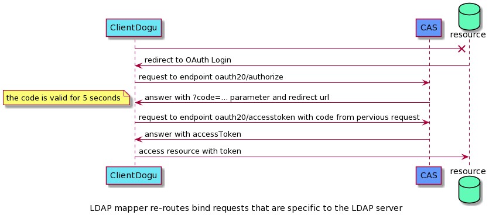

# Using CAS as an OAuth/OIDC Provider

CAS provides OAuth/OIDC as a protocol for authentication including SSO/SSL.
The following sections describe the specification of the OAuth protocol in CAS.

## Create an OAuth/OIDC Service Account for a Dogu

For a Dogu to use the OAuth/OIDC endpoints of CAS, it must register with CAS as a client.
For this purpose, the request for a CAS service account can be stored in the `dogu.json` of the respective Dogu.

**Entry for an OAuth client:**
``` json
"ServiceAccounts": [
    {
        "Type": "cas",
        "Params": [
            "oauth"
        ]
    }
]
```

**Entry for an OIDC client:**
``` json
"ServiceAccounts": [
    {
        "Type": "cas",
        "Params": [
            "oidc"
        ]
    }
]
```

The credentials of the service account are generated randomly (see [create-sa.sh](https://github.com/cloudogu/cas/blob/develop/resources/create-sa.sh)) and stored encrypted in the secret
of the respective Dogu. The credentials consist of the `CLIENT_ID` and the `CLIENT_SECRET`.
For CAS, the `CLIENT_SECRET` is stored encrypted in the `cas-config` secret.

### OAuth Endpoints and Flow

The following steps describe a successful OAuth authentication flow.

1. Request a short-lived token: [Authorize endpoint](endpoint_authorize_en.md)
2. Exchange the short-lived token for a long-lived token: [AccessToken endpoint](endpoint_accessToken_en.md)
3. The long-lived token can now be used to authenticate against resources.
   Currently, CAS only provides the user profile as a resource: [Profile endpoint](endpoint_profile_en.md)


